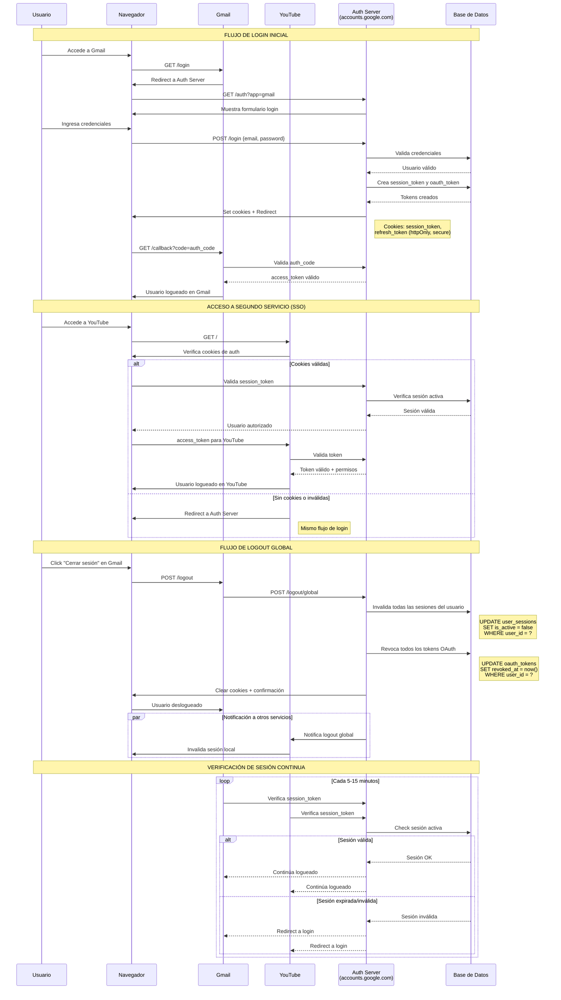

Explicación del Diseño
Tablas Principales:

users - Información básica de usuarios
user_sessions - Sesiones activas con tokens de autenticación
applications - Servicios registrados (Gmail, YouTube, Drive, etc.)
oauth_tokens - Tokens de acceso específicos por aplicación
user_permissions - Permisos otorgados por usuario/aplicación

Características Clave:

Tokens centralizados: Una sesión principal que autoriza acceso a múltiples servicios
Revocación global: Al cerrar sesión, se invalidan todos los tokens
Auditoría completa: Registro de todas las acciones de autenticación
Seguridad: Tokens con expiración, intentos de login monitoreados

Flujo de Funcionamiento:

Login único: El usuario se autentica una vez en el servidor central
Propagación automática: Los otros servicios reconocen la sesión existente
Verificación continua: Los servicios validan periódicamente con el servidor central
Logout global: Al cerrar sesión, se notifica a todos los servicios

Este diseño te permite replicar la experiencia de Google donde "una sesión = acceso a todo" y "un logout = salida de todo".

